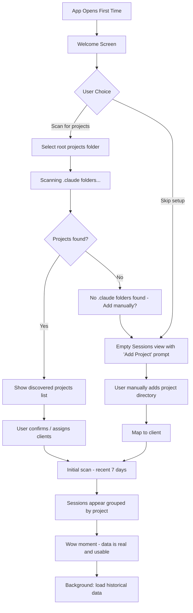
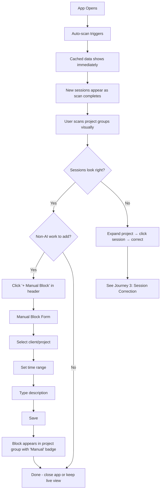
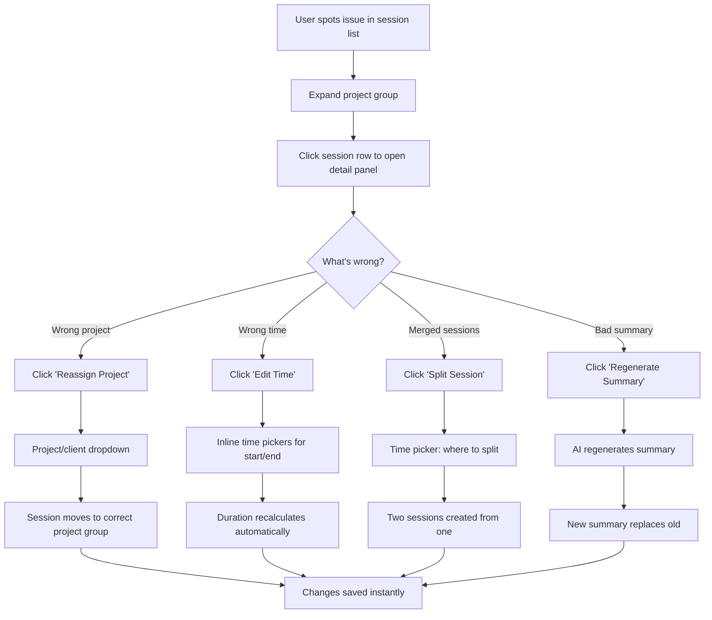
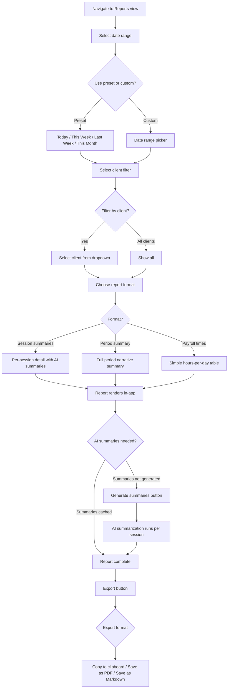
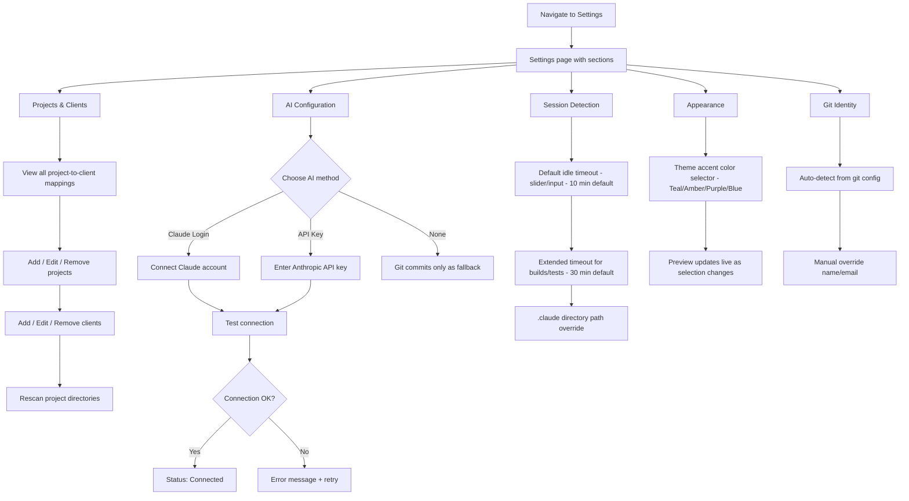

# UX Design Specification ViberTime

**Author:** Looki
**Date:** 2026-03-04

---

<!-- UX design content will be appended sequentially through collaborative workflow steps -->

## Executive Summary

### Project Vision

ViberTime is a desktop Electron application that passively tracks developer working time by reading AI coding assistant session data from local `.claude` folders. It targets freelance and contract developers who work across multiple clients and projects simultaneously using AI-assisted workflows — a work pattern where traditional time tracking is impossible. The app detects sessions via configurable idle timeouts, correlates git commits for context, and generates AI-powered work summaries. The core value proposition is zero-friction time tracking: accurate, fair billing backed by real data with no behavior change required.

### Target Users

**Primary: "Alex the Contract Dev"**
Freelance/contract developer managing 2-3 clients across 4-6 projects. Uses Claude Code as their primary development workflow, frequently running parallel AI sessions. Tech-savvy, bills hourly or by project, and needs defensible time attribution. Opens ViberTime on-demand to review sessions and generate client reports — typically weekly at invoicing time. Values accuracy, speed, and professional presentation.

**Key user characteristics:**
- Comfortable with developer tools and configuration
- Time-pressured — wants reports generated in minutes, not hours
- Trust-sensitive — needs to verify accuracy before sending to clients
- Multi-context — mentally tracks work across several projects simultaneously

### Key Design Challenges

- **First-run complexity:** Users must configure project directories, map them to clients, and set up AI access before receiving value. The onboarding flow must minimize time-to-first-insight despite necessary setup steps.
- **Session correction UX:** Splitting, reassigning, and adjusting auto-detected sessions are precision editing tasks that must feel effortless — not like spreadsheet manipulation.
- **Information density:** Sessions, clients, projects, token usage, and multi-format reports must be surfaced across a focused 4-page app without overwhelming the user.

### Design Opportunities

- **Instant gratification on first scan:** The first scan reconstructing a week of work is the product's best sales pitch. This moment must feel magical and immediately demonstrate value.
- **Report generation as the hero flow:** Select client, pick date range, receive a polished exportable report in seconds. This is the core success moment — making it feel fast and professional is a competitive advantage.
- **Visual timeline of parallel work:** A timeline view showing sessions across projects could make parallel work patterns visible in a way no other tool achieves — turning ViberTime's unique capability into a signature UX element.

## Core User Experience

### Defining Experience

ViberTime's core experience loop is a **daily check-in** — the user opens the app, glances at detected sessions, verifies accuracy, and adds manual time blocks for work outside AI tools (testing, meetings, code review). This daily habit builds trust in the data so that the weekly **report generation** moment is confident and fast.

The core loop: Open → Verify today's sessions → Add manual blocks if needed → Close. Weekly: Select date range → Choose report format → Export.

### Platform Strategy

- **Desktop (Electron):** Mouse/keyboard primary. No touch optimization needed.
- **On-demand app:** Opens when needed, not a persistent background process. Must feel instant — cached data visible immediately on launch.
- **Offline-first:** All core functionality works offline. AI summarization is the only network-dependent feature, with graceful fallback to git commits or timestamps only.
- **Single window:** No multi-window complexity. Sidebar navigation between four core views.

### Effortless Interactions

- **Project discovery:** Auto-scan for `.claude` folders across the file system. If auto-discovery isn't feasible, the user points to their root projects directory and ViberTime finds all `.claude` folders within it. No manual per-project directory entry.
- **First scan:** Immediate results. The moment the app knows where to look, it scans and displays sessions — no waiting, no progress bars that take minutes. This is the product's first impression.
- **Adding manual time blocks:** Must be as easy as "click the gap, type what you did." Testing sessions, meetings, and code review happen outside AI tools — capturing them shouldn't feel like a separate workflow.
- **Session review:** Sessions are visually clear at a glance — which project, how long, what happened. Corrections (reassign, split, adjust time) are inline, not buried in modals.

### Critical Success Moments

1. **First scan (the wow moment):** User points ViberTime at their projects and immediately sees a reconstructed history of their work sessions — accurately attributed to the right projects. This is the moment they trust the product.
2. **First report export:** User selects a client, picks a date range, chooses a report format, and gets a clean, professional report ready for an invoice. The moment billing becomes effortless.
3. **Daily verification:** User opens the app and confirms today's sessions look right in under 30 seconds. Trust is built through consistent daily accuracy.

### Experience Principles

1. **Show value instantly** — The first scan is the wow moment. Data appears, it's real, it's usable. No configuration wall before that payoff.
2. **Daily check-in, not daily chore** — The app opens fast, shows today's sessions at a glance, and makes adding manual blocks trivial.
3. **Setup is guided, not guessed** — Auto-discover `.claude` folders where possible, or let the user point to their project root. Explicit client mapping. No ambiguity.
4. **Reports are three clicks** — Pick date range, pick format (session summaries, full period summary, or payroll times), done.

## Desired Emotional Response

### Primary Emotional Goals

- **Confidence** — "This data is accurate. I can bill on it without second-guessing." The user trusts the system enough to attach reports directly to invoices.
- **Relief** — "I never have to reconstruct my week from memory again." The burden of time tracking is lifted permanently.
- **Control** — "I can see exactly where my time went and fix anything that's off." The user is never at the mercy of the automation — they can always correct, adjust, and verify.
- **Professionalism** — "These reports make me look organized to my clients." The output elevates the user's image, not just their efficiency.

### Emotional Journey Mapping

| Stage | Desired Emotion | Design Implication |
|-------|----------------|-------------------|
| First launch | Curiosity → Excitement | Fast scan, immediate visible results |
| First scan results | Surprise → Trust | Accurate data presentation, recognizable sessions |
| Daily check-in | Calm confidence | Quick glance, no friction, fast in-and-out |
| Correcting a session | "No big deal" | Inline editing, instant feedback, undo-friendly |
| Report generation | Satisfaction → Pride | Clean output, professional formatting |
| Sending to client | Professional confidence | Export looks polished, data is defensible |

### Micro-Emotions

**Critical to cultivate:**
- Confidence over confusion — every screen answers "what am I looking at?" immediately
- Trust over skepticism — data sources are transparent, sessions show their evidence
- Accomplishment over frustration — tasks complete quickly, no dead ends or error loops

**Critical to prevent:**
- **Anxiety** ("Is it tracking?") — Clear status indicators. The user should never wonder if the system is working.
- **Distrust** ("Is this accurate?") — Show the source data. Let users verify any session against the raw evidence.
- **Overwhelm** ("Too much data") — Progressive disclosure. Show summaries first, details on demand.
- **Frustration** ("This is broken / too hard") — Every correction is fast, forgiving, and reversible. No multi-step wizards for simple fixes.

### Design Implications

- **Confidence → Transparent data provenance:** Sessions show where they came from (which `.claude` folder, which git commits). Users can verify, not just trust.
- **Relief → Passive operation:** The app does its job without being asked. No reminders, no timers, no "don't forget to log" nudges.
- **Control → Inline editing everywhere:** Corrections happen where you see the problem — not in a separate edit screen. Split, reassign, adjust time — all in-context.
- **Professionalism → Report polish:** Reports should look like they came from a proper billing tool, not a developer side project. Clean typography, clear structure, ready to attach to an invoice.
- **No frustration → Forgiving interactions:** Undo support, confirmation only for destructive actions, no data loss from accidental clicks.

### Emotional Design Principles

1. **Trust through transparency** — Never hide how a number was calculated. Show the evidence behind every session and summary.
2. **Calm through simplicity** — Default views are clean and scannable. Complexity is available but never forced.
3. **Confidence through consistency** — The app behaves predictably. Same patterns for editing, same layouts for reviewing, same flow for reporting.
4. **Pride through polish** — Every user-facing output (reports, session views, summaries) should feel crafted, not generated.

## UX Pattern Analysis & Inspiration

### Inspiring Products Analysis

**VS Code**
- Activity bar + sidebar navigation provides clear spatial orientation — users always know where they are and can switch contexts with one click
- Progressive disclosure keeps the default experience clean while making power features accessible through contextual menus, command palette, and keyboard shortcuts
- Status bar provides ambient system information without demanding attention — perfect model for scan status and session tracking indicators
- Inline editing philosophy — fix problems where you see them, not in a separate modal or form

**Terminal / CLI Tools**
- High information density with minimal visual chrome — data is the interface
- Instant responsiveness for local operations — no unnecessary loading states
- Keyboard-driven workflows for power users who want speed over discoverability
- Monospace typography makes data (timestamps, durations, project names) scannable

### Transferable UX Patterns

**Navigation Pattern: Activity Bar + Content Panel**
- VS Code's left sidebar icon navigation maps perfectly to ViberTime's four views (Sessions, Reports, Clients, Settings)
- Single-click navigation, persistent sidebar, clear active state
- Supports the "daily check-in" pattern — open app, you're already on Sessions

**Data Display Pattern: Dense but Scannable Lists**
- Session lists should follow the Linear/GitHub pattern — rows with key info (project, duration, time range), expandable for detail
- Color-coded project/client indicators for instant visual grouping
- Inline actions visible on hover — edit, split, reassign without opening a separate view

**Status Pattern: Ambient Awareness**
- VS Code-style status bar showing last scan time, session count, or sync status
- Prevents the "is it tracking?" anxiety without demanding attention

**Editing Pattern: Inline Corrections**
- VS Code's inline editing model — click a session field to edit it in place
- No modal dialogs for simple corrections (reassign, adjust time)
- Modals reserved only for complex actions (split session, add manual block with multiple fields)

**Report Pattern: Filter → Format → Export**
- Toggl-style date range picker (presets: today, this week, last week, custom range)
- Format selection (session detail, daily summary, period summary/payroll)
- One-click export — the final action should feel decisive and satisfying

### Anti-Patterns to Avoid

- **Manual start/stop timers** (Toggl, Harvest) — the entire premise of ViberTime is that tracking is passive. No timer UI, no "forgot to start" anxiety.
- **Dashboard-first landing** (many analytics tools) — charts and graphs aren't actionable for daily check-in. Session list is the landing page, not a dashboard.
- **Wizard-based setup** (enterprise tools) — multi-step setup wizards feel heavy. ViberTime should scan first, configure second.
- **Modal-heavy editing** (JIRA) — opening dialogs to make simple changes creates friction. Inline editing keeps the user in flow.
- **Over-designed empty states** (some modern apps) — for a developer tool, empty states should be informative and actionable, not illustrative.

### Design Inspiration Strategy

**Adopt:**
- VS Code's activity bar + sidebar navigation for four core views
- Linear-style dense, scannable list views for sessions
- VS Code's status bar pattern for ambient system awareness
- Toggl's date-range presets for report filtering

**Adapt:**
- VS Code's inline editing for session corrections — simplified for time data rather than code
- Terminal's information density — balanced with enough whitespace for non-terminal users
- GitHub's filter/sort patterns for session and report views — streamlined for fewer data dimensions

**Avoid:**
- Timer-based tracking UI patterns from traditional time trackers
- Dashboard/chart-first landing pages
- Multi-step configuration wizards before showing value
- Modal-heavy edit workflows for simple corrections

## Design System Foundation

### Design System Choice

**shadcn/ui + Tailwind CSS** — a themeable, accessible component system with full source ownership. Selected during architecture phase, confirmed as the right fit for ViberTime's UX goals.

### Rationale for Selection

- **Speed for solo developer** — copy-paste components with no framework lock-in. Components live in the codebase, fully customizable.
- **Accessibility built-in** — built on Radix UI primitives with keyboard navigation, focus management, and screen reader support out of the box.
- **Developer-tool aesthetic** — shadcn's default design language is clean, minimal, and data-dense — aligned with the VS Code-inspired direction.
- **Tailwind CSS integration** — utility-first styling, no naming conventions to debate, tree-shakeable in production. Pairs natively with shadcn/ui.
- **Full control** — no fighting a component library's opinions. Custom dense list variants, specialized report layouts, and inline editing patterns can be built without workarounds.

### Implementation Approach

- **Dark mode default** — the app ships dark. This is a developer tool; dark mode is the expected environment.
- **Semantic color tokens** — all colors referenced through CSS custom properties (e.g., `--background`, `--foreground`, `--primary`, `--muted`, `--accent`). No hardcoded color values in components.
- **Light mode ready** — proper semantic variable architecture ensures a light theme can be added later by swapping token values. Not in MVP scope, but the foundation supports it with zero refactoring.
- **shadcn/ui theming** — leverage shadcn's built-in CSS variable system (`globals.css` with HSL-based tokens). Customize the dark palette to match ViberTime's identity.

### Customization Strategy

**Color System:**
- Base palette: Dark background with high-contrast text (shadcn dark defaults as starting point)
- Client/project color coding: 8-10 distinct accent colors for visual grouping in session lists and reports
- Status colors: Semantic colors for session states (auto-detected, manual, edited) — not relying on color alone per NFR17
- All colors defined as semantic CSS variables — `--session-auto`, `--session-manual`, `--session-edited`, `--client-[n]`

**Typography:**
- System font stack for UI text (fast loading, native feel)
- Monospace for data values (timestamps, durations, token counts) — reinforces the developer-tool identity and improves scannability

**Component Customizations Needed:**
- Dense data table variant for session lists (tighter row height, more columns visible)
- Inline edit fields (click-to-edit pattern on session rows)
- Date range picker with presets (today, this week, last week, custom)
- Report export layout (separate from app UI — clean, printable formatting)

**Spacing & Density:**
- Compact density as default — developer users prefer information density over whitespace
- Consistent spacing scale via Tailwind's default spacing tokens

## Defining Core Experience

### Defining Experience

**"ViberTime automatically tracks my AI coding time across projects."**

This is the one-sentence pitch. Not "it generates reports" — the magic is that tracking happens passively, from data that already exists. Reports are the output; automatic tracking is the experience.

The defining interaction is the moment the user opens ViberTime and sees their work sessions — already detected, already attributed to the right projects, already timestamped. No action required. The data is just there.

**Live awareness mode:** ViberTime can also monitor `.claude` folders in real-time via file system watchers, showing a live dashboard of active projects with running session timers. This transforms the app from a retrospective viewer into a real-time work awareness tool — developers can keep it open to see what they're actively working on, stay on track, and keep an eye on time allocation as it happens.

### User Mental Model

**Current approach (what ViberTime replaces):**
- Guessing at end of week — "I think I spent about 4 hours on Client A's project Tuesday"
- Manual timers forgotten mid-session — especially useless when running parallel AI sessions
- Rough notes in spreadsheets — reconstructed from memory, always inaccurate
- Flat-rate billing — giving up on accurate tracking entirely

**ViberTime mental model:**
- "My AI sessions are already logged — ViberTime just reads them and organizes them by project"
- Each project has its own `.claude` folder, so project attribution is deterministic — no ambiguity, no misattribution
- The app is a **viewer and reporter** for data that already exists, not a tracker that needs to be running
- Optionally, it's a **live board** — keep it open and watch sessions tick in real-time across projects

**Key mental model shift:** Users don't "use" ViberTime to track time. They use Claude Code to work. ViberTime reads the evidence afterward — or watches it live.

### Success Criteria

- **Scan feels instant** — on launch, recent sessions appear immediately. Historical data loads in background on first use. Subsequent launches show only incremental updates.
- **100% attribution accuracy** — every session maps to exactly one project via its `.claude` folder path. No guessing, no "which project was this?"
- **Zero manual effort for tracking** — the only manual actions are adding non-AI time blocks and making occasional corrections.
- **Summaries persist** — AI-generated summaries for sessions and time spans are stored in the database. Generate once, reuse forever. No re-summarizing the same session.
- **Live monitoring works passively** — file system watchers detect active sessions automatically. The live dashboard updates without user intervention.

### Novel UX Patterns

**Combination of established patterns used in a novel context:**

ViberTime doesn't require novel interaction patterns — it uses familiar list views, filters, and reports. The novelty is in **what it shows**, not **how it shows it**.

- **Established patterns:** Data tables, date filters, inline editing, export — all well-understood by developer users
- **Novel context:** Passive time tracking from AI session data. No other tool does this, so the "data source" is novel even though the UI patterns are familiar
- **Novel live pattern:** Real-time dashboard showing active sessions with running timers — like a project-aware stopwatch board that runs itself
- **No user education needed** for the interface — the learning curve is understanding what ViberTime can do, not how to use it

**Progressive data loading (first launch):**
- Scan recent work first (last 7 days) and display immediately
- Background-load historical data while the user explores recent sessions
- Progress indicator in status bar for background loading — ambient, not blocking
- Subsequent launches: incremental scan only (new/changed sessions since last scan)

### Experience Mechanics

**1. Initiation — App Launch:**
- User opens ViberTime
- Auto-scan triggers immediately — no button press needed
- Recent sessions appear within seconds (cached data from SQLite on subsequent launches, quick scan of recent data on first launch)
- File system watchers start monitoring `.claude` folders for active sessions

**2. Interaction — Daily Check-in (Sessions View):**
- Sessions page is the landing view — today's sessions visible immediately
- Each session row shows: project name (color-coded), time range, duration, summary snippet
- User scans the list visually — "yep, that looks right"
- If needed: click to add a manual time block for non-AI work (testing, meetings)
- If needed: inline edit to adjust a session (rare — attribution is deterministic)

**3. Interaction — Live Dashboard:**
- Shows currently active projects with running session timers
- Multiple active sessions visible simultaneously (parallel work across projects)
- Color-coded by client/project — instant visual awareness of where time is going
- Running totals for the day per project/client
- Passive — user can glance at it or keep it on a second monitor. No interaction needed.

**4. Feedback — Confidence Signals:**
- Session count and total hours visible at a glance
- Color-coded project indicators match the client/project configuration
- "Last scanned: just now" in status bar confirms freshness
- Live sessions show a pulsing or animated indicator — "this is happening now"
- AI summary status per session (summarized, pending, unavailable) visible but not noisy

**5. Completion — Report Generation:**
- Navigate to Reports
- Select date range (presets: today, this week, last week, custom)
- Select client filter (optional)
- Choose format: Session summaries | Period summary | Payroll times
- Export — one click, report is ready for invoice attachment

**6. Background — Scan & Summary:**
- Manual "Scan Now" button available but rarely needed
- File system watchers keep live data current automatically
- AI summaries generated on demand (per session or per time span) and cached permanently
- Summary generation status shown inline — not blocking the UI

## Visual Design Foundation

### Color System

**Base Palette (Dark Mode Default):**
- Background primary: `#16162a` — deep navy-black, softer than pure black
- Background secondary: `#12121e` — sidebar, header, status bar
- Background elevated: `#1e1e32` — hover states, cards, dropdowns
- Surface border: `#2a2a3e` — subtle dividers and borders
- Text primary: `#e0e0e0` — main content text
- Text secondary: `#888888` — labels, metadata, timestamps
- Text muted: `#555555` — disabled, placeholder, tertiary info

**Accent Color (Default — Teal):**
- Primary accent: `#14b8a6` — buttons, active states, durations, totals
- Accent hover: `brightness(1.15)` filter on primary
- Accent subtle: `rgba(20, 184, 166, 0.1)` — active sidebar background, badge backgrounds
- Accent text: `#14b8a6` — active tab text, active nav item, key metrics

**Theme Options (User-selectable in Settings):**

| Theme | Accent | RGB | Feel |
|-------|--------|-----|------|
| Teal (default) | `#14b8a6` | `20,184,166` | Cool, professional, calm |
| Amber | `#f59e0b` | `245,158,11` | Warm, energetic, time-aware |
| Purple | `#a78bfa` | `167,139,250` | Modern, dev-tool, distinctive |
| Blue | `#3b82f6` | `59,130,246` | Familiar, VS Code-adjacent |

**Implementation:** Single CSS custom property `--accent` (and `--accent-rgb` for alpha variants) drives the entire theme. Switching themes changes one variable. Additional themes can be added trivially.

**Project/Client Color Palette (Fixed — Not Affected by Theme):**
8 distinct colors for project identification across session lists, live dashboard, and reports:

| Slot | Color | Hex | Usage |
|------|-------|-----|-------|
| 1 | Blue | `#3b82f6` | Project color |
| 2 | Amber | `#f59e0b` | Project color |
| 3 | Emerald | `#10b981` | Project color |
| 4 | Red | `#ef4444` | Project color |
| 5 | Violet | `#8b5cf6` | Project color |
| 6 | Pink | `#ec4899` | Project color |
| 7 | Cyan | `#06b6d4` | Project color |
| 8 | Orange | `#f97316` | Project color |

These colors are chosen for high contrast on dark backgrounds and distinguishability from each other. Users assign colors to projects — the palette is fixed for visual consistency.

**Semantic Status Colors (Fixed):**
- Live/Active: `#4ade80` (green) — pulsing indicator for active sessions
- Auto-detected: Accent color badge — sessions detected from `.claude` data
- Manual: `#a78bfa` (violet) badge — manually added time blocks
- Error/Warning: `#ef4444` / `#f59e0b` — standard semantic colors

### Typography System

**Font Stack:**
- UI text: `-apple-system, BlinkMacSystemFont, 'Segoe UI', sans-serif` — native system fonts for fast loading and platform-native feel
- Data values: `'SF Mono', 'Cascadia Code', 'Consolas', monospace` — timestamps, durations, token counts, timer displays

**Type Scale:**
- App title: 16px, weight 700
- Section headers: 18-20px, weight 700
- Card values (metrics): 24-28px, weight 700, monospace
- Body/row text: 13px, weight 400-600
- Labels/metadata: 11-12px, weight 400, uppercase with letter-spacing for category labels
- Status badges: 10px, weight 600, uppercase

**Rationale:** Compact type scale for information density. Monospace for all numeric data creates visual alignment and reinforces the developer-tool identity. System fonts eliminate load time and feel native on each platform.

### Spacing & Layout Foundation

**Spacing Scale:** Tailwind's default 4px base unit
- Tight (within components): 4px, 8px
- Standard (between elements): 12px, 16px
- Relaxed (between sections): 20px, 24px, 32px

**Layout Structure:**
- Activity bar: 56px fixed width — icon-based navigation
- Content area: fluid, fills remaining width
- Header: fixed height, always visible
- Status bar: fixed bottom, 24px height — ambient info
- No secondary sidebar — content panel is the full workspace

**Density:**
- Compact as default — session rows ~48px height, tight padding
- Information-dense without feeling cramped — achieved through consistent spacing and clear visual hierarchy
- Whitespace used strategically between sections, not within data rows

**Grid:** No formal column grid — content is list-based and card-based. Responsive within the Electron window using CSS grid for dashboard cards and report layouts.

### Accessibility Considerations

- All text meets WCAG AA contrast ratio (4.5:1 minimum) against dark backgrounds — verified for `#e0e0e0` on `#16162a` (11.3:1) and `#888888` on `#16162a` (5.2:1)
- Project color indicators are accompanied by project name text — color is never the sole differentiator (NFR17)
- Status badges use text labels ("Auto", "Manual", "Live") in addition to color
- Keyboard navigation supported for all core workflows via shadcn/ui's Radix primitives
- Focus indicators use the accent color ring — visible and consistent
- Monospace data alignment aids scannability for users with reading difficulties

## Design Direction Decision

### Design Directions Explored

Six layout directions were generated and evaluated via interactive HTML mockups:

- **A: Classic Sidebar** — VS Code activity bar + flat session table
- **B: Top Navigation** — Horizontal nav with stats cards, dashboard feel
- **C: Chronological Timeline** — Vertical timeline grouped by hour
- **D: Split Panel (Master-Detail)** — Session list left, detail right
- **E: Live Dashboard Focus** — Running timers with day-by-project chart
- **F: Ultra Dense** — Terminal-inspired maximum data density

All directions shared the established visual foundation (dark mode, teal accent, project color palette, monospace data values).

**Key insight from evaluation:** Flat chronological session lists mix projects together, making it hard to answer the daily check-in question: "how much time on each project today?" Sessions should be **grouped by project** with expandable drill-down.

### Chosen Direction

**Grouped-by-Project with Three-Level Drill-Down** — a hybrid combining the sidebar navigation (Direction A), stats cards (Direction B), and master-detail depth (Direction D) into a hierarchical grouped view.

**Three levels of information:**

1. **Project Row (collapsed)** — Project name (color-coded), client, session count, token usage, total duration. Scannable at a glance — answers "where did my time go?" in seconds.
2. **Session Row (expanded)** — Individual sessions within a project. Summary snippet, time range, duration, auto/manual/live badge. Answers "what did I do on this project?"
3. **Detail Panel (drilled in)** — Full session detail: duration, time range, token count, commit count, AI-generated summary, git commit list, and edit actions (Edit Time, Reassign, Split, Regenerate Summary). Answers "show me everything about this session."

**Navigation:** VS Code-style activity bar sidebar with 5 views:
- Sessions (landing page, grouped-by-project)
- Live Dashboard (running timers, second-monitor view)
- Reports (date range + format selection + export)
- Clients (client/project management and directory mapping)
- Settings (AI config, idle thresholds, theme, git identity)

**Persistent elements:**
- Stats row at top of Sessions view (today's total, active sessions, session count, token usage)
- Status bar at bottom (watching X projects, last scan time, daily total)

### Design Rationale

- **Grouped by project matches the mental model** — developers think "I worked on payment-api and mobile-app today," not "I had sessions at 8:00, 9:15, 11:45." Project-first hierarchy maps to how they'll bill.
- **Progressive disclosure prevents overwhelm** — collapsed project rows are scannable in seconds. Expanding shows sessions. Drilling in shows full detail. Complexity is available but never forced.
- **Inline detail panel keeps context** — the detail view expands below the session row, not in a separate panel or modal. The user never loses their place in the list.
- **Live sessions are visually distinct** — pulsing green dot on the project row, green duration text, "Live" badge, and "summary will update when session ends" note in the detail panel. No ambiguity about what's active.
- **Manual blocks have different actions** — Edit Description and Delete instead of Split and Regenerate Summary. The UI adapts to the session type.

### Implementation Approach

- **Session list component:** Accordion-style project groups using shadcn/ui Collapsible or custom component. Each group is independently expandable/collapsible.
- **Detail panel:** Inline expansion below the selected session row. Only one detail panel open at a time — clicking a new session closes the previous detail.
- **Stats row:** Four stat cards using CSS grid. Values driven by React Query hooks.
- **Status bar:** Fixed bottom bar, always visible. Updated by file system watcher events and scan completion.
- **Responsive within Electron:** CSS grid adapts to window size. Minimum viable width ~800px. Session summary text truncates with ellipsis at narrow widths.

**Reference mockups:**
- `_bmad-output/planning-artifacts/ux-design-directions.html` — 6 layout explorations
- `_bmad-output/planning-artifacts/ux-design-grouped.html` — chosen direction with interactive drill-down
- `_bmad-output/planning-artifacts/vibertime-theme-explorer.html` — theme switching demo

## User Journey Flows

### Journey 1: First Launch — Setup to Wow Moment

**Goal:** New user installs ViberTime and sees their first reconstructed work history.

**Flow:**



**Screen-by-Screen:**

1. **Welcome Screen** — "Welcome to ViberTime. Let's find your projects." Two paths: "Scan My Projects Folder" (primary button) and "I'll set up manually" (text link to skip).
2. **Folder Picker** — Native OS folder picker. User selects their root projects directory (e.g., `~/projects` or `C:\projects`).
3. **Discovery Results** — List of discovered `.claude` folders with project directory names. Checkboxes to include/exclude. "Assign to Client" dropdown per project (can create new clients inline). "Confirm & Scan" button.
4. **Initial Scan** — Progress indicator as recent sessions load. Sessions appear in the grouped-by-project view as they're processed. Stats cards populate in real-time.
5. **Sessions View (populated)** — The wow moment. User sees their work history reconstructed. Status bar shows "Loading historical data..." for background processing.

**Skip Path:** User lands on empty Sessions view. Prominent empty state: "No projects configured. Add a project to start tracking." Button: "+ Add Project" which opens a form (directory path + client assignment).

**Error States:**
- No `.claude` folders found in selected directory → Friendly message: "No AI sessions found in this folder. Try a parent directory, or add projects manually."
- Folder permission denied → "Can't access this folder. Try another location or check permissions."

---

### Journey 2: Daily Check-in + Adding Manual Blocks

**Goal:** User opens ViberTime, verifies today's sessions, adds time for non-AI work.

**Flow:**



**Manual Block Form (Modal):**
- Client/Project dropdown (pre-populated with configured projects)
- Date picker (defaults to today)
- Start time / End time pickers
- Description text field
- Save / Cancel buttons

**Interaction Details:**
- App opens → cached SQLite data renders instantly → auto-scan runs in background → new sessions fade in as detected
- Stats cards update as scan completes
- If a project group already exists for the manual block's project, the block appears within it
- If no project group exists (e.g., a meeting for a new client), a new group is created

---

### Journey 3: Session Correction — Fixing a Bad Session

**Goal:** User notices an incorrect session and fixes it quickly inline.

**Flow:**



**Correction Interactions:**
- **Reassign:** Dropdown appears inline in detail panel. Select new project/client. Session animates from old project group to new one.
- **Edit Time:** Start/end time fields become editable. Duration updates live as times change. Save button confirms.
- **Split:** Time picker appears with a slider or input between session start and end. "Split Here" button creates two sessions. Both remain in same project group.
- **Regenerate Summary:** Button triggers AI re-summarization. Loading spinner on summary text. New summary replaces old. Previous summary is not preserved.

**Key UX principles:**
- All corrections happen in the inline detail panel — no navigation away
- Changes save immediately (optimistic update)
- Undo available via toast notification: "Session updated. Undo?"
- Stats cards and project group totals recalculate automatically

---

### Journey 4: Report Generation

**Goal:** User generates a client-ready time report for invoicing.

**Flow:**



**Report View Layout:**
- **Filter bar (top):** Date range presets + custom picker | Client dropdown | Format selector
- **Report content (main area):** Rendered report matching selected format
- **Action bar (bottom or top-right):** "Generate Summaries" (if needed) | "Export" dropdown

**Report Formats:**
1. **Session Summaries:** Each session listed with project, time range, duration, and AI summary. Grouped by day. Project color indicators.
2. **Period Summary:** AI-generated narrative summarizing all work across the selected date range. Total hours, project breakdown, key accomplishments.
3. **Payroll Times:** Simple table — date, hours worked, project. No summaries, no descriptions. Just numbers for timesheet submission.

**AI Summary Generation:**
- If summaries already cached → report renders instantly
- If summaries needed → "Generate Summaries" button with progress (3 of 12 sessions summarized...)
- Summaries cached permanently after generation — future reports for same sessions are instant

---

### Journey 5: Settings Configuration

**Goal:** User configures ViberTime — AI access, idle thresholds, theme, projects, git identity.

**Flow:**



**Settings Layout:**
- Vertical section list on the left (or stacked sections with headers)
- Each section expands to show its controls
- Changes save automatically (no save button needed) — toast confirmation: "Settings saved"

**Settings Sections:**

1. **Projects & Clients** — Table of all configured projects with client assignment, directory path, and color. Add/edit/remove. "Rescan" button to re-discover `.claude` folders.
2. **AI Configuration** — Radio/toggle for method (Claude Login / API Key / None). Connection test button. Status indicator (Connected / Not configured / Error). Credential stored via safeStorage.
3. **Session Detection** — Idle timeout slider (1-60 min, default 10). Extended timeout for builds/tests (10-120 min, default 30). `.claude` directory path with browse button (defaults to `~/.claude`).
4. **Appearance** — Theme accent color selector with live preview (Teal, Amber, Purple, Blue). Future: light mode toggle.
5. **Git Identity** — Auto-detected name and email from `git config`. Manual override fields. Used to filter commits to only the current user's work.

---

### Journey Patterns

**Common patterns across all journeys:**

**Navigation Pattern:** Sidebar icon click → view loads with cached data → background refresh if needed. No loading screens for cached data.

**Progressive Disclosure Pattern:** Summary first → expand for detail → drill in for full context. Applied consistently: project groups → sessions → detail panel. Report presets → custom filters → advanced options.

**Inline Editing Pattern:** Click a value to edit it. Changes save automatically. Toast with undo. No separate edit screens or modal forms for simple changes.

**Feedback Pattern:** Optimistic updates (UI changes immediately). Toast notifications for confirmations. Status bar for ambient system state. Progress indicators only for operations > 2 seconds.

**Error Recovery Pattern:** Friendly message explaining what went wrong. Clear action to fix (retry, try different input, manual alternative). Never a dead end — always a path forward.

### Flow Optimization Principles

1. **Minimize steps to value** — First scan shows results in under 30 seconds of first launch. Daily check-in is open-and-glance. Report generation is 3 clicks.
2. **Default to the common case** — Today's sessions on launch. This week for reports. Auto-detected settings where possible. Manual overrides available but not required.
3. **Never block the user** — Background scanning, progressive loading, cached data first. AI summarization is async and non-blocking.
4. **Make corrections cheap** — Every edit is inline, instant, and undoable. The cost of fixing a mistake is seconds, not minutes.
5. **Show the source** — Sessions link to their evidence (git commits, `.claude` data). Reports show how numbers were calculated. Trust comes from transparency.

## Component Strategy

### Design System Components

**shadcn/ui + Tailwind CSS** provides the foundation layer. The following shadcn/ui components are used directly with ViberTime's dark theme tokens applied via `globals.css`:

| Component | ViberTime Usage |
|-----------|----------------|
| **Button** | Primary/secondary actions, export, scan, generate summaries |
| **Collapsible** | Foundation for project group expand/collapse |
| **Dialog** | Manual block form modal, split session modal |
| **DropdownMenu** | Export format picker, session actions menu |
| **Select** | Client/project dropdowns, report format selector |
| **Badge** | Auto/Manual/Live/Edited session status |
| **Toast (Sonner)** | Undo notifications, settings saved, errors |
| **Slider** | Idle timeout configuration in settings |
| **Tooltip** | Activity bar icon labels, truncated text |
| **ScrollArea** | Session lists, report content, settings |
| **Progress** | Scan progress, AI summary generation progress |
| **Card** | Stats cards foundation, settings sections |
| **Table** | Payroll report, project/client settings table |
| **Calendar** | Date picking for reports and manual blocks |
| **Popover** | Date picker container, color picker |
| **RadioGroup** | AI config method selection, report format |
| **Switch** | Future light mode toggle |
| **Checkbox** | Project discovery include/exclude |
| **Input** | Text fields, time inputs, search |
| **Label** | Form labels throughout |
| **Skeleton** | Loading states for sessions, reports |
| **Separator** | Section dividers |

**Customization approach:** All components inherit semantic colors from CSS custom properties. Density customized via tighter padding on Badge, Button (sm variant), and Table rows. Theme switching works automatically through the `--accent` variable system.

### Custom Components

The following components are unique to ViberTime and built using shadcn/ui primitives + Tailwind:

#### ActivityBar

**Purpose:** Primary navigation — always visible, switches between 5 app views.
**Content:** App logo at top, 5 icon buttons (Sessions, Live, Reports, Clients, Settings).
**States:** Default (muted icon), Active (accent background + accent icon), Hover (elevated background).
**Accessibility:** `role="navigation"`, tooltips on each icon, keyboard arrow-key navigation between items.
**Interaction:** Single click switches view. Active indicator (accent left border or background) shows current view.

#### ProjectGroup

**Purpose:** Collapsible container grouping all sessions for one project. Top-level view in Sessions page.
**Content:** Project color dot, project name, client name, session count badge, token count, total duration.
**Actions:** Click to expand/collapse, revealing SessionRows within.
**States:** Collapsed (summary row), Expanded (summary + session list), Live (pulsing green dot if active session exists).
**Variants:** Standard (auto-detected sessions), With manual blocks, With live sessions.
**Accessibility:** `role="group"`, `aria-expanded`, keyboard Enter/Space to toggle.
**Built with:** shadcn Collapsible as foundation.

#### SessionRow

**Purpose:** Individual session within a ProjectGroup. Clickable to reveal detail panel.
**Content:** Time range (monospace), duration, summary snippet (truncated), status badge (Auto/Manual/Live).
**Actions:** Click to open/close SessionDetailPanel below.
**States:** Default, Selected (accent left border, elevated bg), Live (green duration text, pulse).
**Accessibility:** `role="button"`, `aria-expanded` for detail panel state.

#### SessionDetailPanel

**Purpose:** Full session information + edit actions. Expands inline below SessionRow.
**Content:** Duration, time range, token count, commit count, AI summary, git commit list.
**Actions:** Edit Time, Reassign Project, Split Session, Regenerate Summary (auto sessions) / Edit Description, Delete (manual blocks).
**States:** Viewing, Editing (inline fields active), Loading (summary regeneration).
**Accessibility:** Focus trap when editing, Escape to close, action buttons keyboard-accessible.

#### LiveCard

**Purpose:** Shows an actively running session on the Live Dashboard view.
**Content:** Project name + color dot, client name, running timer (updating every second), today's total for this project.
**States:** Active (pulsing green border, ticking timer), Idle (dimmed, timer paused), Recently ended.
**Interaction:** Click navigates to session detail in Sessions view.
**Built with:** shadcn Card as foundation + CSS `@keyframes` for pulse animation.

#### StatsBar

**Purpose:** Summary metrics row at top of Sessions view.
**Content:** 4 cards — Today's Total (duration), Active Sessions (count), Total Sessions (count), Tokens Used (count).
**States:** Loading (skeleton), Populated, Updating (subtle pulse on value change).
**Variants:** Sessions view stats, Report view stats (total hours, sessions, projects).
**Built with:** shadcn Card in a CSS grid row.

#### StatusBar

**Purpose:** Ambient system status — always visible at bottom of app window.
**Content:** Left: "Watching X projects" + last scan time. Right: Daily total hours, live indicator if active.
**States:** Idle ("Last scan: 2 min ago"), Scanning ("Scanning..."), Background loading ("Loading historical data...").
**Interaction:** Click on scan status triggers manual rescan.

#### DateRangePicker

**Purpose:** Date range selection for reports with preset shortcuts.
**Content:** Preset buttons (Today, This Week, Last Week, This Month), custom range calendar.
**States:** Preset selected, Custom range active (two calendars), Invalid range error.
**Built with:** shadcn Calendar + Popover + Button group — composite component.

#### TimeEditor

**Purpose:** Inline editing of session start/end times with live duration recalculation.
**Content:** Two time inputs (HH:MM format), duration display that updates live.
**States:** View mode (text), Edit mode (inputs), Saving, Error (end before start).
**Interaction:** Click duration or time to enter edit mode. Tab between fields. Enter to save, Escape to cancel.

#### SplitSessionControl

**Purpose:** Choosing a split point to divide one session into two.
**Content:** Time slider or input between session start and end, preview of resulting two sessions.
**States:** Selecting split point, Confirming, Error (split point at boundary).
**Built with:** shadcn Slider + Dialog.

#### ManualBlockForm

**Purpose:** Modal form for adding non-AI time blocks.
**Content:** Client/Project dropdown, date picker, start/end time pickers, description text field.
**States:** Empty (defaults to today), Filled, Validating, Error (missing fields, end before start).
**Built with:** shadcn Dialog + Select + Calendar + Input.

#### ReportRenderer

**Purpose:** Displays generated reports in the selected format.
**Content:** Format-dependent — session list with summaries, narrative summary, or payroll table.
**States:** Empty (no date range selected), Loading (generating summaries), Rendered, Exporting.
**Variants:** Session Summaries (grouped by day), Period Summary (narrative), Payroll Times (table).

#### ThemeSelector

**Purpose:** Color swatch picker in Appearance settings with live preview.
**Content:** 4 color swatches (Teal, Amber, Purple, Blue) with labels and active indicator.
**States:** Default selection, Hover preview, Selected (checkmark + accent border).
**Interaction:** Click swatch to apply theme immediately. `--accent` CSS variable updates live.

#### WelcomeFlow

**Purpose:** First-launch onboarding — folder selection, project discovery, client assignment.
**Content:** 3-4 step flow: Welcome → Folder Pick → Discovery Results → Initial Scan.
**States:** Per step, plus skip path to empty Sessions view.
**Built with:** shadcn Dialog as container, native folder picker via Electron dialog API.

#### EmptyState

**Purpose:** Contextual guidance when a view has no data.
**Content:** Icon, headline, description, primary action button.
**Variants:** No projects configured, No sessions found, No reports generated, No live sessions active.
**Pattern:** Reusable across all views with different content props.

### Component Implementation Strategy

**Foundation Layer (shadcn/ui):**
- Used directly with ViberTime's dark theme tokens applied via `globals.css`
- Density customized: tighter padding on Badge, Button (sm variant), Table rows
- All components inherit semantic colors from CSS custom properties — theme switching works automatically

**Custom Component Layer:**
- Built as React components using shadcn/ui primitives (Collapsible, Card, Popover) + Tailwind utility classes
- All custom components use the same CSS custom property system (`--accent`, `--background`, etc.)
- Follow shadcn's composition pattern — small, focused components composed together
- No external component libraries beyond shadcn/ui — full control over every pixel
- Animations via Tailwind's transition utilities + CSS `@keyframes` for pulse/timer effects
- All components support keyboard navigation and screen reader labeling

**File Organization:**
```
src/renderer/components/
├── ui/                    # shadcn/ui components (auto-generated)
├── sessions/              # ProjectGroup, SessionRow, SessionDetailPanel
├── live/                  # LiveCard
├── reports/               # ReportRenderer, DateRangePicker
├── settings/              # ThemeSelector, ManualBlockForm
├── shared/                # ActivityBar, StatsBar, StatusBar, EmptyState, TimeEditor
└── onboarding/            # WelcomeFlow
```

### Implementation Roadmap

**Phase 1 — Core Components (MVP critical path):**
- ActivityBar — needed for all navigation
- ProjectGroup + SessionRow + SessionDetailPanel — the entire Sessions view
- StatsBar — Sessions view header
- StatusBar — app shell
- EmptyState — first-launch experience
- WelcomeFlow — onboarding

**Phase 2 — Daily Workflow Components:**
- ManualBlockForm — adding non-AI time blocks
- TimeEditor — session time corrections
- DateRangePicker — report filtering
- ReportRenderer — report generation and display

**Phase 3 — Live & Enhancement Components:**
- LiveCard — live dashboard view
- SplitSessionControl — session splitting
- ThemeSelector — appearance settings

This roadmap follows user journey criticality: Setup → Daily use → Reports → Live monitoring → Customization.

## UX Consistency Patterns

### Data Display Patterns

**Project Group Rows (Collapsed):**
- Left: project color dot (8px circle) + project name (weight 600) + client name (muted text)
- Right: session count badge + token count (monospace, muted) + total duration (monospace, accent color, weight 700)
- Height: 48px. Full-width click target for expand/collapse.
- Chevron icon on far left rotates 90deg on expand.

**Session Rows (Within Expanded Group):**
- Indented 16px from project row. Left border: 2px project color.
- Left: time range (monospace, e.g., "09:15 – 11:42") + status badge (Auto/Manual/Live)
- Center: summary snippet (truncated with ellipsis at available width)
- Right: duration (monospace, weight 600)
- Height: 40px. Full-width click target for detail panel.

**Stats Cards:**
- Label on top (11px, uppercase, muted, letter-spacing), value below (24px, monospace, weight 700)
- Value uses accent color for primary metric (today's total), default text for others
- 4 cards in a CSS grid row with equal width. Gap: 12px.

**Monospace Rule:** All numeric/time data rendered in monospace: timestamps, durations, token counts, timer displays, session counts. Never use proportional fonts for data values.

**Truncation Rule:** Text truncates with ellipsis. Tooltips show full content on hover. Never wrap long text in data rows — density is preserved through truncation.

**Alignment Rule:** Right-align all numeric values (durations, counts, totals) in rows and tables. Left-align text (names, summaries, descriptions).

### Inline Editing & Correction Patterns

**Click-to-Edit Pattern:**
- View mode: text displayed normally. Cursor changes to pointer on hover.
- Edit mode: text replaced with input field, same size and position. Focus is set automatically. Original value pre-filled.
- Save: Enter key or click outside (blur). Cancel: Escape key restores original value.
- Feedback: Brief accent-color highlight on the saved value (200ms fade), then toast with "Updated. Undo?"

**Optimistic Updates:**
- All edits apply to the UI immediately before server/DB confirmation.
- If save fails: revert the UI change, show error toast with retry action.
- Stats cards, project group totals, and status bar recalculate automatically on every edit.

**Undo Pattern:**
- Every destructive or modifying action shows a toast: "[Action description]. Undo?" with a 5-second timeout.
- Undo reverts to the previous state silently (no additional toast).
- Only one undo available at a time — new actions replace the previous undo opportunity.

**Reassign Animation:**
- When a session is reassigned to a different project: session row slides out of current group, slides into target group.
- If target group was collapsed, it expands to show the arriving session.
- Both group totals recalculate with the accent-color highlight.

### Feedback Patterns

**Toast Notifications (Sonner):**
- Position: bottom-right of the app window
- Duration: 5 seconds (auto-dismiss), persistent for errors until dismissed
- Types:
  - **Success:** Accent color left border. Used for saves, exports, completed actions.
  - **Error:** Red left border. Used for failed saves, scan errors, network failures. Includes retry action when applicable.
  - **Info:** No colored border. Used for undo opportunities, status changes.
- Maximum 3 toasts stacked. Oldest dismissed when 4th arrives.

**Status Bar Updates:**
- Left side: system state text, updates in-place with no animation
- Scanning state: "Scanning..." with subtle spinner icon
- Idle state: "Watching X projects · Last scan: [relative time]"
- Background loading: "Loading historical data... (X%)"
- Right side: daily total (monospace, accent), live indicator (green dot + "Live") when active sessions exist

**Progress Indicators:**
- Only shown for operations >2 seconds (per experience principles)
- Scan progress: status bar text + optional Progress bar if scan has measurable progress
- AI summary generation: inline progress text "Generating summaries (3 of 12...)" with Progress bar
- First-launch scan: sessions appear progressively as detected — no blocking progress screen

**Live Indicators:**
- Active session: pulsing green dot (CSS animation, 2s cycle) on project group row and live card
- Green text color for running duration values
- "Live" badge on session rows (green variant)
- Status bar shows green dot + "Live" when any session is active

### Loading & Empty State Patterns

**Initial Load (Cached Data):**
- SQLite data renders immediately on app launch — no loading screen
- Auto-scan runs in background — new/updated sessions fade in as detected (opacity 0→1, 300ms)
- Stats cards show cached values immediately, update when scan completes

**Skeleton Loading:**
- Used only when no cached data exists (first launch, or view never loaded before)
- Skeleton matches the exact layout of the final content: project group rows, session rows, stats cards
- Skeleton uses `--muted` background color with subtle shimmer animation
- Replace skeleton → real content with a crossfade (200ms)

**Empty States:**
- Consistent layout: centered vertically, icon (24px, muted) + headline (16px, weight 600) + description (13px, muted) + primary action button
- Never a dead end — always an action the user can take
- Specific empty states:
  - **Sessions (no projects):** "No projects configured." → "+ Add Project" button
  - **Sessions (projects configured, no sessions):** "No sessions found. Run a scan to detect sessions." → "Scan Now" button
  - **Live Dashboard (no active):** "No active sessions. Start working in Claude Code and sessions will appear here."
  - **Reports (no range selected):** "Select a date range to generate a report." (filter bar is the action)
  - **Report results (no data):** "No sessions found in this date range." → Suggest trying a different range

**Background Operations:**
- Never block the UI for background work. Status bar shows ambient progress.
- Background historical data loading: status bar text only, no modal or overlay
- File system watcher events: new sessions fade into view silently

### Button & Action Hierarchy

**Button Variants (mapped to shadcn/ui):**

| Variant | Usage | Examples |
|---------|-------|----------|
| **Primary (default)** | One primary action per view/section | "Scan My Projects Folder", "Confirm & Scan", "Export" |
| **Secondary (outline)** | Supporting actions alongside primary | "Cancel", "I'll set up manually", "Generate Summaries" |
| **Ghost** | Tertiary/inline actions, minimal visual weight | "Edit Time", "Reassign", "Split", nav items |
| **Destructive** | Irreversible actions | "Delete" manual block (requires confirmation) |

**Action Placement:**
- Primary action: right side of header/toolbar or bottom-right of modal
- Cancel/dismiss: left of primary action
- Inline edit actions: within the detail panel, grouped horizontally
- Destructive actions: separated from other actions with a divider or placed last

**Destructive Action Pattern:**
- Red text/icon, never primary button styling
- Requires confirmation via popover: "Delete this manual block? This cannot be undone." with Cancel + Delete buttons
- Only manual blocks can be deleted — auto-detected sessions cannot (they come from real data)

**Icon Buttons:**
- Used in activity bar and inline actions where space is tight
- Always have a tooltip (shadcn Tooltip) showing the action name
- Hit target: minimum 32x32px even if icon is smaller

### Form Patterns

**Modal Forms (Manual Block, Split Session):**
- shadcn Dialog component
- Title at top, form fields stacked vertically, actions at bottom-right
- Primary action disabled until all required fields are valid
- Escape key or click outside to dismiss (with unsaved changes warning if fields are dirty)
- Fields: Label above input, error text below input in red, inline validation on blur

**Settings Forms (Auto-save):**
- No submit button — changes save automatically on change/blur
- Toast confirmation: "Settings saved" (success variant)
- Validation inline — red border + error text below field
- Slider values show current value next to the slider
- Radio groups and toggles apply immediately on selection

**Inline Forms (Click-to-Edit):**
- Follow the click-to-edit pattern defined above
- No form container — the editable field replaces the display text in-place
- Single field at a time — no multi-field inline forms (use modals for multi-field edits)

**Validation Rules:**
- End time must be after start time (time editors and manual block form)
- Required fields: visual indicator not needed (all fields in the app are contextually required)
- Client/project selection: dropdown with search. If no match, offer "Create new client" inline
- API key: masked input, "Test Connection" button validates before saving

### Navigation & Drill-Down Patterns

**Activity Bar Navigation:**
- Single click switches view instantly (no loading between cached views)
- Active view: accent background on icon, accent left border (3px)
- Hover: elevated background on icon
- Icons ordered by usage frequency: Sessions, Live, Reports, Clients, Settings
- Keyboard: Tab to activity bar, arrow keys between icons, Enter to select

**Progressive Drill-Down (Sessions View):**
- Level 1 (Project Groups): all collapsed by default on launch. Click to expand.
- Level 2 (Session Rows): visible when group expanded. Click to drill into detail.
- Level 3 (Detail Panel): expands below session row. Only one detail panel open at a time — opening a new one closes the previous.
- Collapse behavior: collapsing a project group also closes any open detail panel within it.
- Keyboard: Enter/Space to expand/collapse groups. Arrow keys to navigate between groups/sessions.

**View Memory:**
- Remember expanded/collapsed state of project groups within a session (don't reset on view switch)
- Remember last active view — reopening the app returns to the last view
- Report filters are NOT remembered between sessions — always start fresh

### Modal & Overlay Patterns

**When to Use Modals:**
- Multi-field input: Manual Block Form (5+ fields)
- Destructive confirmation: Delete manual block
- Complex operations: Split Session (needs visual preview)
- First-launch onboarding: Welcome Flow steps

**When NOT to Use Modals:**
- Single-field edits (use inline click-to-edit)
- Session corrections like reassign, edit time (use detail panel inline)
- Notifications (use toasts)
- Status updates (use status bar)

**Modal Behavior:**
- Backdrop: semi-transparent dark overlay (`rgba(0,0,0,0.6)`)
- Centered in window, max-width 480px for forms
- Close: X button, Escape key, or click backdrop (if no unsaved changes)
- Focus trapped within modal while open
- Entry animation: fade + slight scale (200ms). Exit: fade (150ms).

**Popover Overlays (DateRangePicker, Dropdowns):**
- Triggered by clicking a control element
- Positioned below/above the trigger (auto-placement to stay in viewport)
- Dismiss on click outside or Escape
- No backdrop — content behind remains visible and interactive at the edges

### Design System Integration

All patterns are built on shadcn/ui primitives with ViberTime's CSS custom properties. The patterns above are conventions on *when* and *how* to use the components — not replacements for them. Developers should reference these patterns alongside shadcn/ui documentation to ensure consistent usage across all views.

## Responsive Design & Accessibility

### Responsive Strategy

**Platform context:** ViberTime is a desktop Electron app. There is no mobile or tablet variant. "Responsive" means adapting gracefully to different window sizes on desktop operating systems (Windows, macOS, Linux).

**Window Resize Behavior:**
- The app adapts fluidly to any window size above the minimum
- Activity bar (56px) remains fixed — never collapses or hides
- Status bar (24px) remains fixed at bottom — never hides
- Content area fills all remaining space and adapts its internal layout
- No horizontal scrolling at any supported size — content truncates or wraps

**Layout Adaptation by Width:**

| Window Width | Behavior |
|-------------|----------|
| **< 800px** | Not supported — Electron `minWidth` enforced at 800px |
| **800–1024px** | Compact mode: stats cards stack 2x2, session summary text truncates aggressively, detail panel uses full content width |
| **1024–1440px** | Standard mode: stats cards in 4-column row, session rows show full summary snippets, detail panel comfortable |
| **> 1440px** | Spacious mode: additional whitespace between sections, wider content margins, report preview has generous layout |

**Height Adaptation:**
- Minimum height: 600px (Electron `minHeight`)
- Session list and report content scroll vertically via ScrollArea
- Stats bar and status bar remain fixed (never scroll)
- Detail panel expansion pushes content down — container scrolls to keep expanded content visible

**Specific Component Behavior on Resize:**
- **StatsBar:** 4 cards in a row at 1024px+. Stacks to 2x2 grid below 1024px.
- **ProjectGroup rows:** Duration and token count remain visible at all sizes. Client name truncates first, then session count badge hides at narrowest widths.
- **SessionRow:** Summary snippet is the first to truncate. Time range and duration always visible.
- **SessionDetailPanel:** Full width of content area at all sizes. Internal layout stacks vertically if needed.
- **Report content:** Tables become horizontally scrollable at narrow widths. Narrative text reflows naturally.
- **Live Dashboard:** Cards reflow from 3-column to 2-column to 1-column grid as width decreases.

### Breakpoint Strategy

**Electron window breakpoints (CSS):**

```
--compact:  max-width: 1023px   /* 800–1023px */
--standard: min-width: 1024px   /* 1024–1439px */
--spacious: min-width: 1440px   /* 1440px+ */
```

**Implementation:** Use Tailwind's responsive prefixes (`md:`, `lg:`, `xl:`) mapped to these breakpoints in `tailwind.config.ts`. Since this is Electron (not web), breakpoints respond to window width, not viewport width.

**Default design target:** 1024–1440px (standard mode). This is where the app should look its best — the most common developer monitor range.

**No mobile-first:** Desktop-first design. Media queries adjust downward for compact mode, not upward from mobile.

### Accessibility Strategy

**Compliance Target: WCAG 2.1 Level AA**

This is the industry standard for good accessibility without overengineering for MVP. shadcn/ui's Radix primitives provide strong accessibility foundations out of the box.

**Color & Contrast:**
- All text meets WCAG AA contrast ratios (4.5:1 minimum for normal text, 3:1 for large text)
- Verified: primary text `#e0e0e0` on `#16162a` = 11.3:1 contrast ratio
- Verified: secondary text `#888888` on `#16162a` = 5.2:1 contrast ratio
- Verified: muted text `#555555` on `#16162a` = 3.1:1 (used only for disabled/placeholder — acceptable)
- Project colors are never the sole differentiator — always paired with text labels
- Status badges use text labels ("Auto", "Manual", "Live") in addition to color
- All 8 project colors tested for sufficient contrast on dark backgrounds

**Keyboard Navigation:**
- Full app navigable via keyboard — no mouse-only interactions
- Activity bar: Tab to enter, arrow keys between items, Enter to select
- Session list: Arrow keys between project groups and sessions, Enter/Space to expand/collapse
- Detail panel: Tab through action buttons, Enter to activate, Escape to close
- Modals: Focus trapped within modal, Tab cycles through fields, Escape to close
- All interactive elements have visible focus indicators using accent color ring (`outline: 2px solid var(--accent)`)

**Screen Reader Support:**
- Semantic HTML structure: `<nav>`, `<main>`, `<section>`, `<header>`, `<footer>`
- ARIA attributes on all custom components:
  - ProjectGroup: `role="group"`, `aria-expanded`, `aria-label="[Project Name] - [N] sessions, [duration] total"`
  - SessionRow: `role="button"`, `aria-expanded`, `aria-label="Session [time range], [duration]"`
  - LiveCard: `aria-live="polite"` for timer updates (not `assertive` — avoid interrupting)
  - StatsBar: `aria-label` on each card with "Today's total: X hours" format
  - StatusBar: `role="status"`, `aria-live="polite"` for scan updates
- Skip link: hidden "Skip to main content" link that bypasses activity bar on Tab

**Focus Management:**
- Opening a detail panel moves focus to the panel
- Opening a modal traps focus within the modal
- Closing a modal returns focus to the trigger element
- View switches move focus to the view's first interactive element
- Toast notifications are `role="status"` with `aria-live="polite"` — announced but not focus-stealing

**Motion & Animation:**
- Respect `prefers-reduced-motion` media query:
  - Reduced motion: disable pulse animations on live indicators, skip slide/fade transitions, instant state changes
  - All information conveyed by animation is also conveyed by static indicators (text labels, badges)
- No animation is required to understand the interface — all animations are decorative/enhancing

### Testing Strategy

**Window Resize Testing:**
- Test at minimum size (800x600), standard (1280x800), and spacious (1920x1080)
- Verify no content is clipped, hidden, or overlapping at any size
- Verify text truncation with ellipsis works correctly at compact widths
- Test Electron window maximize/restore behavior

**Keyboard Testing:**
- Navigate every user journey (setup, daily check-in, session correction, report generation, settings) using keyboard only
- Verify all focus indicators are visible
- Verify Tab order is logical (top-to-bottom, left-to-right)
- Verify no focus traps outside of modals

**Screen Reader Testing:**
- Primary: NVDA on Windows (free, widely used)
- Secondary: VoiceOver on macOS (built-in)
- Test that all content is announced correctly
- Test that live regions (timers, scan status) update without being intrusive

**Color & Contrast Testing:**
- Use browser dev tools contrast checker for all text/background combinations
- Test with color blindness simulation (protanopia, deuteranopia, tritanopia) to verify project colors are distinguishable with their text labels
- Verify all themes (Teal, Amber, Purple, Blue) maintain AA contrast ratios

**Automated Testing:**
- `axe-core` integrated into test suite for automated WCAG AA compliance checks
- Run on every component during development
- CI pipeline includes accessibility regression tests

### Implementation Guidelines

**Responsive Development:**
- Use Tailwind responsive prefixes for layout changes at breakpoints
- Use `flex` and `grid` for all layouts — no fixed pixel widths on content containers
- Use `min-width` / `max-width` constraints rather than fixed widths
- Text uses `rem` units for font sizes (inherits from root, respects user preferences)
- Electron `BrowserWindow` configured with `minWidth: 800`, `minHeight: 600`

**Accessibility Development:**
- Use semantic HTML elements before reaching for ARIA attributes
- Every interactive custom component must have: `role`, `aria-label` (or `aria-labelledby`), keyboard handler, focus indicator
- Use shadcn/ui components as the foundation — they include Radix accessibility primitives
- Test with keyboard after implementing every new interactive component
- Add `aria-live` regions for any content that updates dynamically (timers, scan status, toast notifications)
- Include `prefers-reduced-motion` checks in all animation code

**Accessibility Checklist for New Components:**
1. Can I reach and operate this with keyboard alone?
2. Does it have a visible focus indicator?
3. Does a screen reader announce its purpose and state?
4. Does it meet 4.5:1 contrast ratio for text?
5. Does it convey information through means other than color alone?
6. Does it respect `prefers-reduced-motion`?
