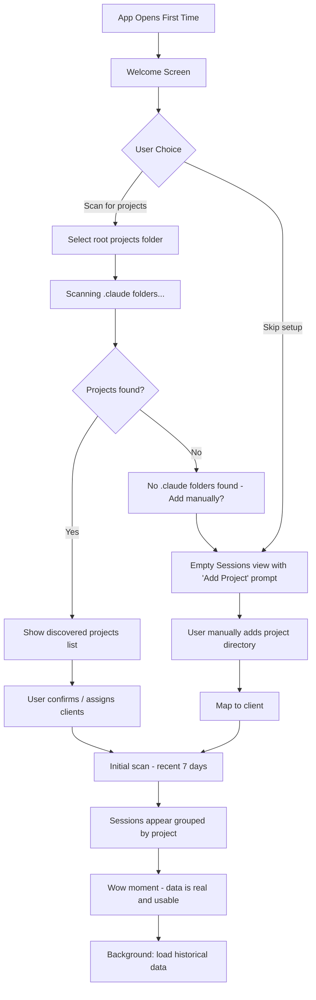
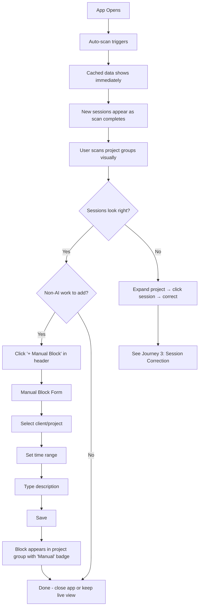
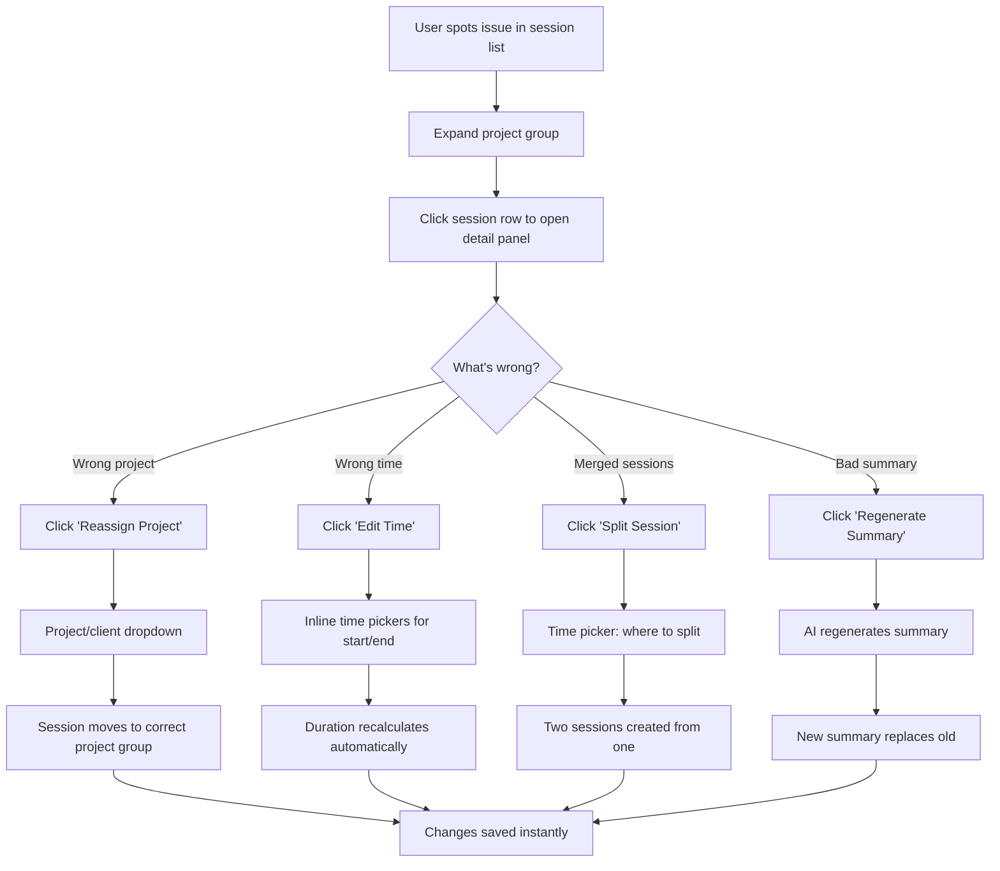
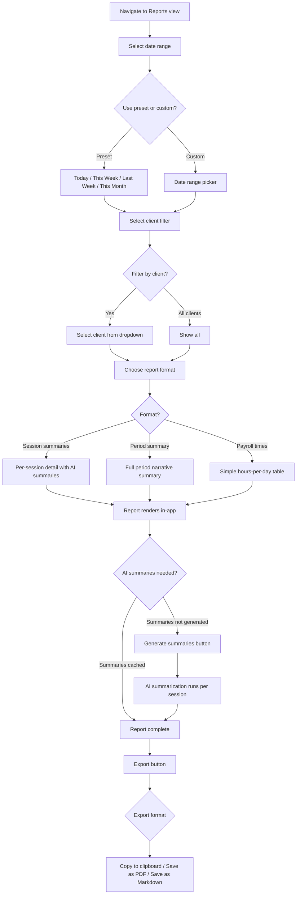
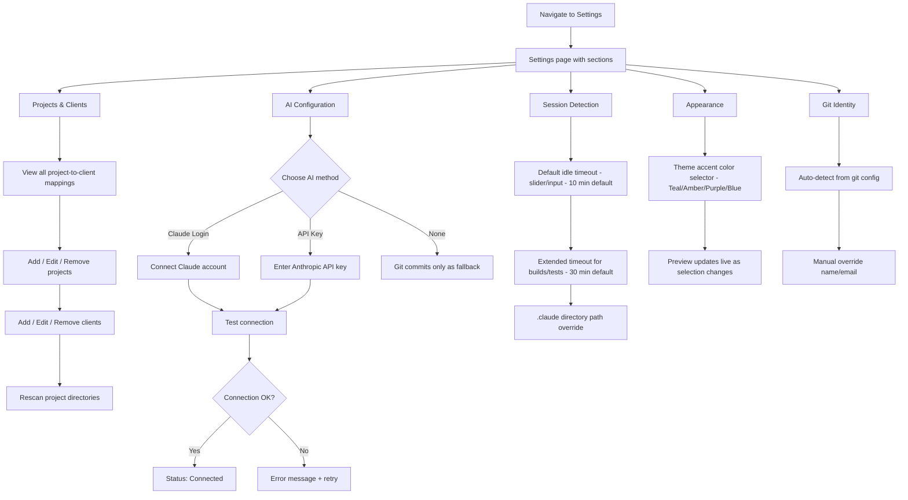

## User Journey Flows

### Journey 1: First Launch — Setup to Wow Moment

**Goal:** New user installs ViberTime and sees their first reconstructed work history.

**Flow:**

**Screen-by-Screen:**

1. **Welcome Screen** — "Welcome to ViberTime. Let's find your projects." Two paths: "Scan My Projects Folder" (primary button) and "I'll set up manually" (text link to skip).
2. **Folder Picker** — Native OS folder picker. User selects their root projects directory (e.g., `~/projects` or `C:\projects`).
3. **Discovery Results** — List of discovered `.claude` folders with project directory names. Checkboxes to include/exclude. "Assign to Client" dropdown per project (can create new clients inline). "Confirm & Scan" button.
4. **Initial Scan** — Progress indicator as recent sessions load. Sessions appear in the grouped-by-project view as they're processed. Stats cards populate in real-time.
5. **Sessions View (populated)** — The wow moment. User sees their work history reconstructed. Status bar shows "Loading historical data..." for background processing.

**Skip Path:** User lands on empty Sessions view. Prominent empty state: "No projects configured. Add a project to start tracking." Button: "+ Add Project" which opens a form (directory path + client assignment).

**Error States:**
- No `.claude` folders found in selected directory → Friendly message: "No AI sessions found in this folder. Try a parent directory, or add projects manually."
- Folder permission denied → "Can't access this folder. Try another location or check permissions."

---

### Journey 2: Daily Check-in + Adding Manual Blocks

**Goal:** User opens ViberTime, verifies today's sessions, adds time for non-AI work.

**Flow:**

**Manual Block Form (Modal):**
- Client/Project dropdown (pre-populated with configured projects)
- Date picker (defaults to today)
- Start time / End time pickers
- Description text field
- Save / Cancel buttons

**Interaction Details:**
- App opens → cached SQLite data renders instantly → auto-scan runs in background → new sessions fade in as detected
- Stats cards update as scan completes
- If a project group already exists for the manual block's project, the block appears within it
- If no project group exists (e.g., a meeting for a new client), a new group is created

---

### Journey 3: Session Correction — Fixing a Bad Session

**Goal:** User notices an incorrect session and fixes it quickly inline.

**Flow:**

**Correction Interactions:**
- **Reassign:** Dropdown appears inline in detail panel. Select new project/client. Session animates from old project group to new one.
- **Edit Time:** Start/end time fields become editable. Duration updates live as times change. Save button confirms.
- **Split:** Time picker appears with a slider or input between session start and end. "Split Here" button creates two sessions. Both remain in same project group.
- **Regenerate Summary:** Button triggers AI re-summarization. Loading spinner on summary text. New summary replaces old. Previous summary is not preserved.

**Key UX principles:**
- All corrections happen in the inline detail panel — no navigation away
- Changes save immediately (optimistic update)
- Undo available via toast notification: "Session updated. Undo?"
- Stats cards and project group totals recalculate automatically

---

### Journey 4: Report Generation

**Goal:** User generates a client-ready time report for invoicing.

**Flow:**

**Report View Layout:**
- **Filter bar (top):** Date range presets + custom picker | Client dropdown | Format selector
- **Report content (main area):** Rendered report matching selected format
- **Action bar (bottom or top-right):** "Generate Summaries" (if needed) | "Export" dropdown

**Report Formats:**
1. **Session Summaries:** Each session listed with project, time range, duration, and AI summary. Grouped by day. Project color indicators.
2. **Period Summary:** AI-generated narrative summarizing all work across the selected date range. Total hours, project breakdown, key accomplishments.
3. **Payroll Times:** Simple table — date, hours worked, project. No summaries, no descriptions. Just numbers for timesheet submission.

**AI Summary Generation:**
- If summaries already cached → report renders instantly
- If summaries needed → "Generate Summaries" button with progress (3 of 12 sessions summarized...)
- Summaries cached permanently after generation — future reports for same sessions are instant

---

### Journey 5: Settings Configuration

**Goal:** User configures ViberTime — AI access, idle thresholds, theme, projects, git identity.

**Flow:**

**Settings Layout:**
- Vertical section list on the left (or stacked sections with headers)
- Each section expands to show its controls
- Changes save automatically (no save button needed) — toast confirmation: "Settings saved"

**Settings Sections:**

1. **Projects & Clients** — Table of all configured projects with client assignment, directory path, and color. Add/edit/remove. "Rescan" button to re-discover `.claude` folders.
2. **AI Configuration** — Radio/toggle for method (Claude Login / API Key / None). Connection test button. Status indicator (Connected / Not configured / Error). Credential stored via safeStorage.
3. **Session Detection** — Idle timeout slider (1-60 min, default 10). Extended timeout for builds/tests (10-120 min, default 30). `.claude` directory path with browse button (defaults to `~/.claude`).
4. **Appearance** — Theme accent color selector with live preview (Teal, Amber, Purple, Blue). Future: light mode toggle.
5. **Git Identity** — Auto-detected name and email from `git config`. Manual override fields. Used to filter commits to only the current user's work.

---

### Journey Patterns

**Common patterns across all journeys:**

**Navigation Pattern:** Sidebar icon click → view loads with cached data → background refresh if needed. No loading screens for cached data.

**Progressive Disclosure Pattern:** Summary first → expand for detail → drill in for full context. Applied consistently: project groups → sessions → detail panel. Report presets → custom filters → advanced options.

**Inline Editing Pattern:** Click a value to edit it. Changes save automatically. Toast with undo. No separate edit screens or modal forms for simple changes.

**Feedback Pattern:** Optimistic updates (UI changes immediately). Toast notifications for confirmations. Status bar for ambient system state. Progress indicators only for operations > 2 seconds.

**Error Recovery Pattern:** Friendly message explaining what went wrong. Clear action to fix (retry, try different input, manual alternative). Never a dead end — always a path forward.

### Flow Optimization Principles

1. **Minimize steps to value** — First scan shows results in under 30 seconds of first launch. Daily check-in is open-and-glance. Report generation is 3 clicks.
2. **Default to the common case** — Today's sessions on launch. This week for reports. Auto-detected settings where possible. Manual overrides available but not required.
3. **Never block the user** — Background scanning, progressive loading, cached data first. AI summarization is async and non-blocking.
4. **Make corrections cheap** — Every edit is inline, instant, and undoable. The cost of fixing a mistake is seconds, not minutes.
5. **Show the source** — Sessions link to their evidence (git commits, `.claude` data). Reports show how numbers were calculated. Trust comes from transparency.
